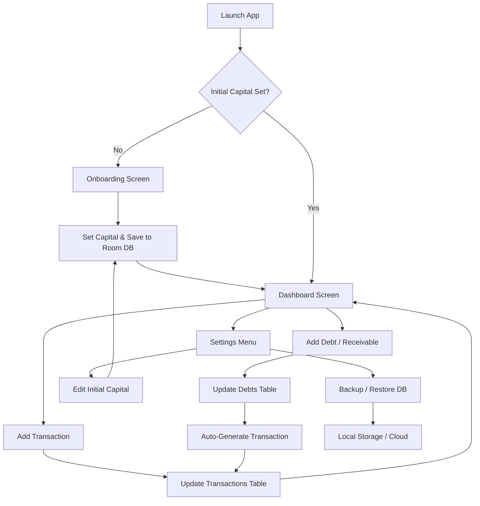

# 💰 MoneyMetric

**MoneyMetric** is a smart, professional personal finance tracker for Android, specifically engineered to help users manage initial capital, daily transactions, and debt-receivable cycles with automated efficiency.

Built using a modern Android tech stack, it ensures high performance, a beautiful interface, and robust local data security.

---

## 🚀 Key Features

-   **📊 Capital Status Dashboard**: Real-time tracking of your Break-Even Point (BEP) with intuitive visual progress indicators.
-   **💸 Transaction Management**: Effortlessly record income and expenses with customizable categories and clear history.
-   **🤝 Debt & Receivable Tracker**: Comprehensive management of money you owe and money owed to you.
-   **🔄 Automated Cash Flow**: Creating a debt/receivable entry automatically generates a corresponding income/expense transaction, streamlining your bookkeeping.
-   **💾 Robust Backup & Restore**: Securely export your database to external storage or cloud services and restore it instantly with a single click.
-   **⚙️ Flexible Configuration**: Securely adjust your initial capital at any time through the dedicated settings menu.

---

## 🛠️ Tech Stack

-   **Language**: [Kotlin](https://kotlinlang.org/)
-   **UI Framework**: [Jetpack Compose](https://developer.android.com/jetpack/compose) (Modern Declarative UI)
-   **Database**: [Room SQLite](https://developer.android.com/training/data-storage/room) (Secure & Typed Local Persistence)
-   **Architecture**: MVVM (Model-View-ViewModel) for clean separation of concerns.
-   **Navigation**: Jetpack Compose Navigation.
-   **Data Management**: Kotlin Flows & StateFlow for reactive UI updates.

---

## 📈 Application Workflow



---

## 👥 Collaborators

This project is proudly developed by a professional team:

-   **Syahrul Huda** - *Project Lead*
    -   Oversees project vision, application architecture, and core feature integration.
-   **Wildan Rafi** - *Data Handler*
    -   Manages database schema, backup/restore logic, and financial data flow integrity.
-   **Thon Mading** - *UI/UX Designer*
    -   Designs the modern, responsive interface and ensures a seamless user experience.

---

## 📦 Installation & Setup

### Prerequisites
-   Android Studio Ladybug (or latest version)
-   Android SDK Level 34+

### Steps
1.  **Clone the Repository**:
    ```bash
    git clone https://github.com/syahrulhuda/MoneyMetric.git
    ```
2.  **Open Project**: Launch Android Studio, select `Open Project`, and navigate to the MoneyMetric folder.
3.  **Build & Run**: Connect your Android device or start an emulator, then click the `Run` button in Android Studio.

---

## 📄 License

This project was created for educational purposes (Entrepreneurship Project). Feel free to use and develop it further!

---

**Try the App Now**: [Download APK](https://drive.google.com/file/d/1ruC9mLVce0WGIBPJZlA406tfszVgukI0/view?usp=sharing)
